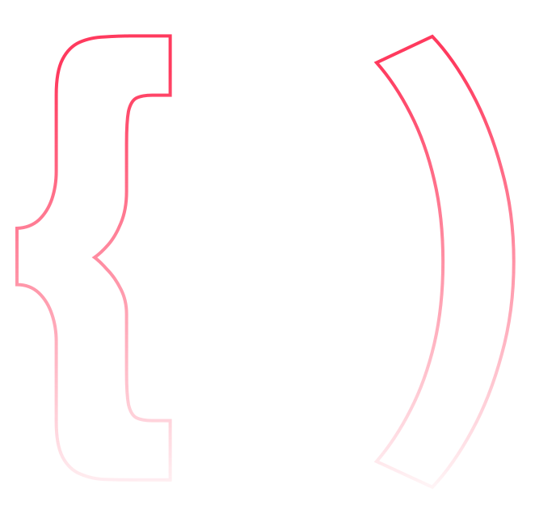

<h2>Hello World ☕</h2>

Iuri, ou mais conhecido como iuricode, é um programador instrutor da empresa Digital House. Produz conteúdo desde 2020 sobre desenvolvimento front-end. Extremamente apaixonado por café e cultura japonesa.

 

<h3>Caso queira acompanhar meus conteúdos:</h3> 

  
  
  
  
  

